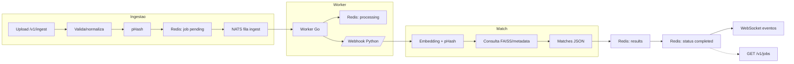

# BusquePet - Fluxo Completo (Obsidian)

```mermaid
flowchart LR
    client(Cliente: upload/consulta)
    api[API Go /v1/ingest]
    preproc[Pré-processa + normaliza imagem]
    storage["shared-storage/ (originais + normalizados)"]
    phash[Calcula pHash]
    redis[Redis: status/jobs]
    nats[NATS: busquepet.ingest]
    worker[Worker Go]
    python[Webhook Python /v1/match]
    pipeline["Pipeline híbrido (embedding + pHash)"]
    faiss[FAISS + metadata CSV]
    results[Redis: results/matches]
    ws[WebSocket /v1/ws]
    httpGet[GET /v1/jobs/{id}]

    client -->|POST imagem| api
    api --> preproc --> storage
    preproc --> phash
    api -->|salva status pending| redis
    api -->|publica tarefa| nats
    api -->|status pending| ws

    nats --> worker
    worker -->|status processing| redis
    worker -->|notify status| ws
    worker -->|POST imagem normalizada + pHash| python

    python --> pipeline --> faiss
    pipeline -->|matches| python
    python -->|resposta JSON| worker

    worker -->|salva matches| results
    worker -->|status completed/failed| redis
    worker -->|job.result + status| ws

    client <-->|status/result| ws
    client -->|GET status/result| httpGet
    httpGet --> redis
    httpGet --> results
```



- Leia em Obsidian para ver os diagramas; ajustável conforme necessidade.
